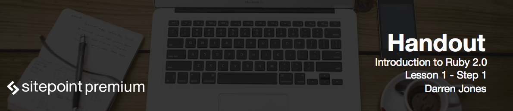

# Introduction to Ruby

Hello, and welcome to the **Introduction to Ruby 2.0** course! My name is Darren Jones, and I'll be introducing you to the Ruby programming language.

Ruby is a simple yet powerful object-oriented programming language. It was developed in the mid 90's by Yukihiro Matsumoto, also known as Matz. His aim with Ruby was to make programming more enjoyable and productive. Ruby always had a devoted following in Japan, along with a small, but loyal, following in the west.

But it wasn't until David Heinemeier Hansson released the **Ruby on Rails** web framework in 2005 that Ruby's popularity soared almost overnight. Rails make it easy and enjoyable to produce full stack database-driven web applications, and a lot of its success was due to the design of the Ruby programming language.

# Objects

One of the key principles of Ruby is that every part of the language is an object. An **object** in programming is something that has its own properties and actions known as **methods**.

```ruby
'hello'.reverse
2.even?
[3, 1, 2].sort
```

For example, here the word "hello" is an object that can be written backwards using the `reverse` method.

Or we can check if the number `2` is even.

The last line of code shows that we can sort a list of numbers into order using the `sort` method.

We'll be looking at objects like these and many others throughout the course.

In the first lesson we're going to start off by installing Ruby. Then we're going to be using **Interactive Ruby (IRB)** to have a go at writing some code. Then we're going to learn how to save a program to a file and then how to run it. And finally, we're going to look at how you can turn your Ruby program into a web application and see it running in a browser.

Hopefully, this course will help you to discover what makes so many people love the power and flexibility that Ruby offers!