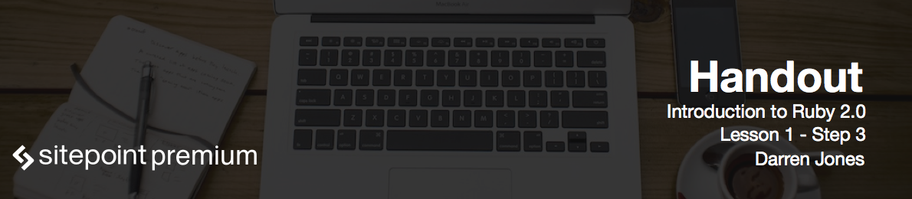

# What is IRB

Now that we've got Ruby installed, it's time to have a go at writing some code. We're going to use interactive Ruby or IRB, which runs directly in the terminal.

To get started, all you need to do is open up the terminal and type in

```
irb
```

# Hello World

Enter the following:

```ruby
puts 'Hello IRB'
```

Then press `Enter` - you will see the output of the program. You've just written your first piece of Ruby code!

# Puts Command

`puts` is a Ruby command that stands "for put string" - it outputs a string of text to the terminal. 

The string is "Hello IRB". It is a Ruby object that stores the text in between the quote marks.

# Reverse Command

Let's take a look at some of the things we will be working with later in the course. Don't worry if you don't completely understand what is happening at this stage. The idea here is to see what a powerful and expressive language Ruby is.

Let's start by starting a string of text backwards. This is as easy as adding the `reverse` method onto the end:

```ruby
puts 'Hello IRB'.reverse
```

The dot (`.`) notation is how we add a method to an object in Ruby. We'll be looking at strings and lots of other methods in lesson two.

# Calculations

Ruby can also deal with numbers:

```ruby
4 - 6 * 2
```

For example, you can check if a number is odd or even:

```ruby
2.even?
1.odd?
```

Let's put that into a logical statement:

```ruby
puts "Even" if 2.even?
```

This statement above is basically saying output the string if two is even.

What I like about this is that the program reads almost like an English sentence, and it's very clear what is happening. You'll often find that well-written Ruby code is easy to figure out what's happening, because it has such a rich and descriptive syntax.

# Logical statements

A list inside square brackets is known as an **array**:

```ruby
[3,1,2]
```

If we add `sort` onto the end of the array, which is another method, then Ruby will sort the numbers into order:

```ruby
[3,1,2].sort
```

Let’s finish off with one last example to demonstrate the expressive nature of Ruby:

```ruby
3.times do puts 'Ruby' end
```

We're basically telling Ruby to do something (display some text in this case) three times.

To exit IRB, simply type

```
exit
```