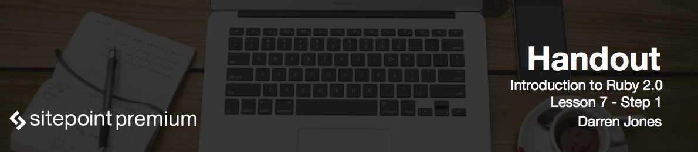

# Course Conclusion

Congratulations! You've reached the end of the introduction to Ruby 2.0 course!

You should now have a good foundation in the basics of programming in Ruby.

- We installed Ruby, used IRB and wrote our first program.
- We also learned how to install RubyGems and use Sinatra.
- In the strings lesson, we learned about the different string methods and how to use string interpolation to insert Ruby code into strings.
- In the numbers lesson we learned all about integers and their methods, as well as learning about how to write logical statements using `if`, `elsif` and `until`.
- In lesson four, we learned all about arrays, hashes, and ranges, as well as how to create loops and iterate over a collection.
- Next, we learned how to create our own methods with different parameters.
- And in the last lesson, we learned all about classes and how to add methods to the built-in classes, as well as creating your own, and using inheritance.

But there's always still more to learn. Now that you have a good grounding in the basics of Ruby, I'd suggest that there were some topics here that you might to want to look into.

- First of all, there's the `Time` and `Date` objects in Ruby.
- Then there's Ruby's file operations, that allow you to do things like open and close files using Ruby code.
- You could learn how to use Ruby modules to organize your code.
- And you could learn more about Sinatra or look into the Ruby on Rails web framework.

I've added some links in the resources section below that will point you in the right direction. I hope that you carry on programming in Ruby. But even if you do decide to learn another language, the concepts that you've learned in this course will serve you well. The main thing to do is keep programming, keep learning, and most of all, have fun!

Useful Links

Extra Things to learn about:

 Ruby Modules - (http://ruby-doc.org/core-2.2.3/Module.html)

 Ruby Time Class - (http://www.ruby-doc.org/core-2.2.3/Time.html)

 Ruby File Operations - (http://www.ruby-doc.org/core-2.2.3/File.html)

#Further Learning:

Try Ruby (http://tryruby.org/levels/1/challenges/0) 
An interactive tutorial that gives you a whirlwind wour of Ruby in about 15 minutes

Pickaxe book (http://pragprog.com/book/ruby4/programming-ruby-1-9-2-0) 
The definitive ruby book, the first edition is available for free online (http://ruby-doc.com/docs/ProgrammingRuby/), or you can get the latest version in print or e-book format.

Learn to Program (http://pragprog.com/book/ltp2/learn-to-program) 
A great book that introduces the basics of programming using Ruby. There is a free version (http://pine.fm/LearnToProgram/) and also a print version

Ruby Tapas (http://www.rubytapas.com/) 
Avdi Grimm produces these short videos

Jump Start Sinatra (http://www.sitepoint.com/store/jump-start-sinatra/?utm_source=sitepoint&utm_medium=email-newsletter&utm_campaign=sinatra1) 
A book by yours truly that shows you how to build a full web application using Ruby and Sinatra

Sinatra Up and Running (http://shop.oreilly.com/product/0636920019664.do) 
another book, written by the maintainer of Sinatra that goes into more depth about how Sinatra actually works

SitePoint Ruby Channel (http://www.sitepoint.com/ruby/) 
This is full of articles about Ruby, Sinatra and Ruby on Rails – feel free to browser around